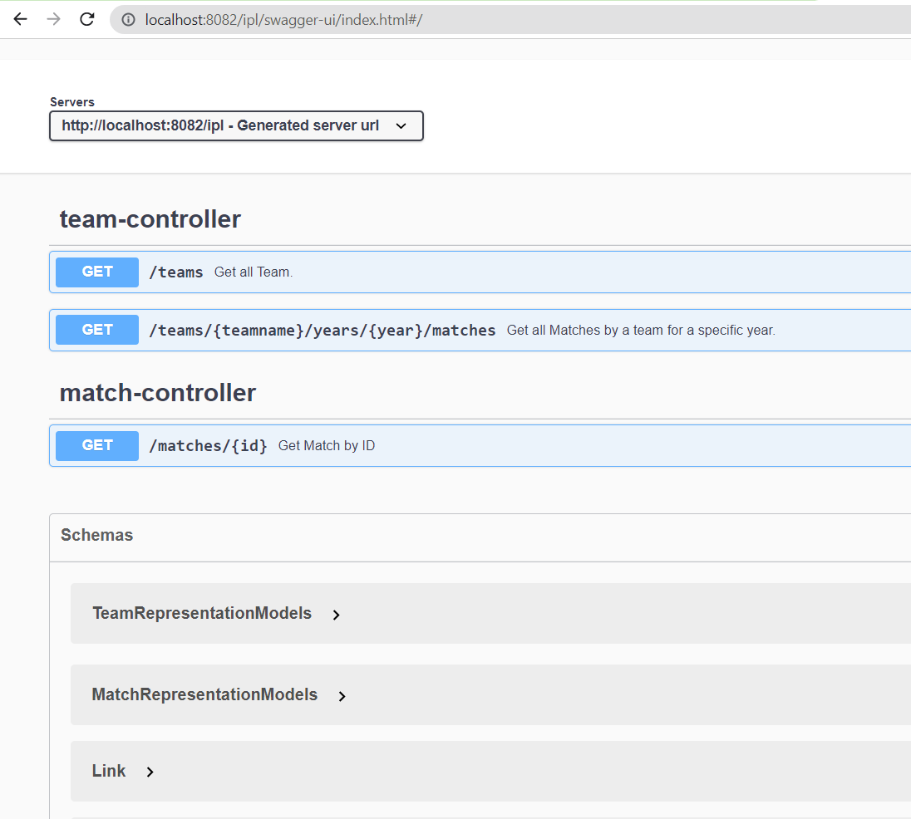

### IPL Dashboard ###
It is a simple dashboard to show IPL match information from year 2010 to 2020.

This repository serves the different REST endpoints to provide different IPL related data to Web UI.

### Technology Used ###
1. Spring boot
2. Cassandra Database
3. Spring boot starter Hateoas to frame to Hateoas links
4. Swagger for Documentation
5. Angular, Html, css for UI

### How to build ###
1. Navigate to the root of the project.
2. Execute below command

   ```
   ./build-script.sh <DOCKER_HUB_USERNAME> <DOCKER_HUB_PASSWORD>
   ```

### Docker Deployment (using Docker image)###
1. Navigate inside the docker-compose directory.
2. Update `DATASTAX_ASTRA_SECURE_CONNECTION_BUNDLE` value in .env file.
3. Run the below command
   ```
   docker-compose up -d
   ```

### How to run (using jar)###
1. Get the secure-connect zip file for Astra DB to your local machine 
2. Run the below command

   ```
   java -jar .\ipl-data-provider.jar --datastax.astra.secure-connection-bundle=<Path to Secure connect.zip>
   ```
   
   #### Example ####
   ```
   java -jar .\ipl-data-provider.jar --datastax.astra.secure-connection-bundle=C:\MyWork\resources\secure-connect.zip

   ```  

### Helm chart for Kubernetes Deployment ###
   
### API Documentation ###
Once application is started, the documentation about the different REST endpoints can be found using the below link
``
http://localhost:8082/ipl/swagger-ui/index.html
``



